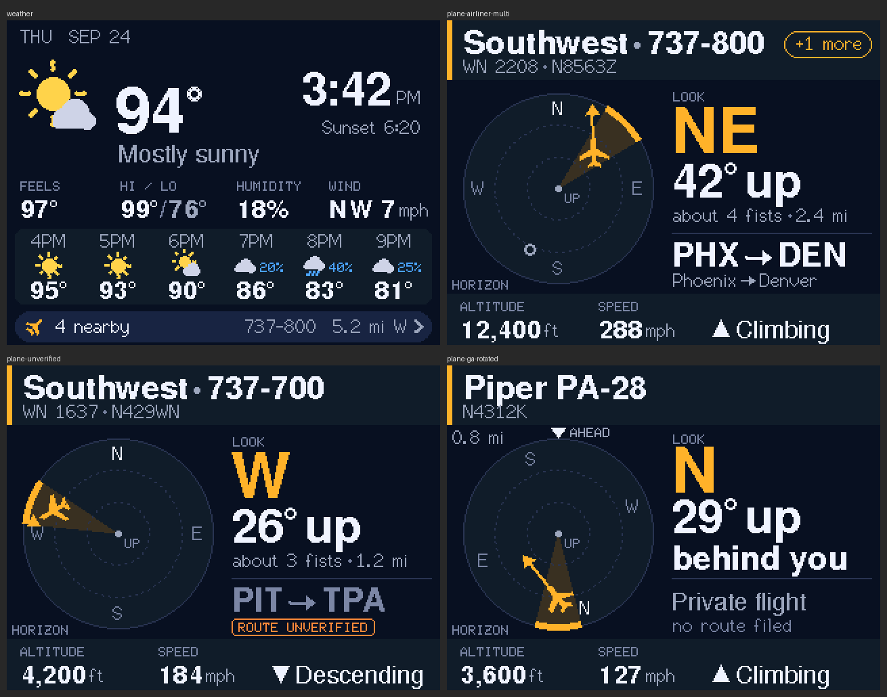

# SkyDesk

A desk display for the ESP32 **Cheap Yellow Display** (CYD). It shows the weather
by default. When an aircraft passes close overhead, it switches to a plane card
that tells you **where to look in the sky**, **what it is**, and **where it's going**.
When the plane leaves, it goes back to the weather.



*Renders from `docs/mockups/`, drawn with the real TFT_eSPI fonts at device resolution.*

## What you need
- ESP32-2432S028R ("CYD"), CYD2USB revision (two USB ports). For the older single-USB
  board, see `platformio.ini`.
- 2.4 GHz WiFi.
- [PlatformIO](https://platformio.org/) (VS Code extension or CLI).
- No API keys. Weather is Open-Meteo, aircraft are adsb.fi / adsb.lol, and routes are adsbdb.

## Quick start
1. Copy `include/secrets.h.example` to `include/secrets.h` and set `WIFI_SSID` / `WIFI_PASSWORD`.
2. Set your location. The default is Gilbert, AZ. Uncomment the `OBS_*` lines in
   `secrets.h`: latitude, longitude, **ground elevation in feet**, and a place name.
   Set `NTP_TZ` too if you're not in Arizona.
3. Build and flash:
   ```bash
   pio run -t upload
   ```
4. Watch the log (optional):
   ```bash
   pio device monitor
   ```

## Using it
| What you see | What it means |
|---|---|
| Weather screen, `4 nearby ›` chip | The radar is live. **Tap it to open the plane map** |
| Plane card, big amber `NE` | Face north-east |
| `42° up · about 4 fists` | Hold your fist at arm's length: one fist is about 10°. Stack four fists above the horizon |
| `UP / overhead` | Look straight up |
| Arrow on the circle | Which way it's moving across the sky |
| `ROUTE UNVERIFIED` | The schedule database disagrees with where the plane actually is |
| `+1 more` | Tap to cycle through the other planes overhead |

- **Press 1–3 s and release** on a plane card to dismiss that plane.
- **Hold 3 s** anywhere to open Settings:
  - **Facing direction.** If you set which way you face when you look at the screen,
    the circle turns "you-relative" and the card says `behind you` / `ahead-left`.
  - Dim at night.
  - Touch calibration. Hold 3 s again inside Settings to jump straight to it.

The circle is a map of the sky. The center is straight up and the rim is the horizon.

### Plane map
A top-down, north-up map of the local roads, with you (the cyan dot) in the middle and
every airborne plane at its real position with a short trail.

- **Tap near a plane** to select it. The bottom strip describes it. **Tap the strip** to open
  its card.
- **Tap the `10 MI` chip** to zoom (5 / 10 / 20 mi). Tap **‹**, or leave it alone for 2 minutes,
  to go back to the weather.
- The **brown disc** is everything within 3 nm (3.5 mi) of you. A plane card pops when a
  plane is within 3 nm **and at least 25° above the horizon**. A low plane can be inside
  the disc without triggering, and when it's selected the strip shows its angle
  (`20° up`) so you can see why.
- **Dim amber** planes will pop a card within about a minute. When one is selected, the strip
  says `overhead in ~30 s`.
- The map background is generated once on your PC from OpenStreetMap
  (© OpenStreetMap contributors, ODbL). If you change `OBS_LAT/OBS_LON`, re-run:
  ```bash
  python tools/basemap/make_basemap.py
  ```

## Tuning
All thresholds are in `include/config.h`:
- when a plane counts as overhead: `ENTER_RADIUS_NM`, `ENTER_MIN_ELEV_DEG`
- how long the card stays: `MIN_PLANE_DWELL_S`, `DEPART_GRACE_S`
- poll rates

Near an airport you may want `ENTER_MIN_ELEV_DEG` around 20.

## Development
- `pio run` compiles.
- `sh test/host/run.sh` runs the host tests (geo, tracker state machine, parsing on
  real captured payloads, route plausibility).
- `python docs/mockups/screens.py final` re-renders the UI mockups.
- Agents: start with [AGENTS.md](AGENTS.md) and [docs/README.md](docs/README.md).

## On-device acceptance (needs a human)
From `docs/01-product-spec.md`, plus open items from the design review:
- [ ] Power on. Weather appears within ~20 s of WiFi connecting.
- [ ] A plane within 3 nm and ≥ 25° up brings up the plane card within ~6 s.
- [ ] The compass word and the circle match reality. Check with a phone compass.
- [ ] The card never flickers between two aircraft.
- [ ] When the plane leaves, weather returns within ~10 s of it leaving the zone.
- [ ] Pull WiFi. The last data stays up with a stale warning, and it recovers by itself.
- [ ] **2-second glance test with two people.** They look for 2 s, then answer
      "which window, and how high?".
- [ ] Colors and navy panel tiers stay distinguishable 30–45° off-axis.
- [ ] Touch calibration maps taps correctly after rotation.
- [ ] Watch free heap on serial (`[net] heap free=… min=…` once a minute). `min` should
      stay ≥ 40 KB with the map open at 20 mi.
- [ ] Map: the center matches home. Compare a plane's position with FlightAware.
- [ ] Map: no visible seams between the 5 horizontal bands, and no flicker at 3 s updates.
- [ ] Map: after touch calibration, a tap within about a fingertip of a plane selects it.
- [ ] Map: note how long `WIDENING...` shows after zooming out to 20 mi (should be ≤ 5 s).
